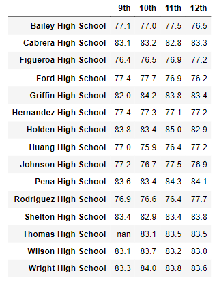
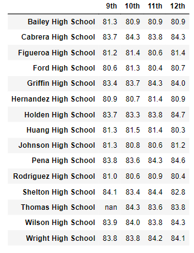

# School District Analysis

## Overview of the School District Analysis

The school board has found evidence of academic dishonesty in the student_complete.csv file; specifically, reading and math grades for Thomas High School ninth-graders appear to have been altered. Although the school board does not know the full extent of academic dishonesty, they want to uphold state-testing standards. The report replaced the math and reading scores for Thomas High School with NaNs while keeping the rest of the data intact. The analysis is repeated with NaNs in place and the rest of the data intact.

## Resources

**Data Source:** students_complete.csv, schools_complete.csv.

**Software:** Jupyter.

## Results

District Summary:

School Summary:

Thomas High School perfomance Summary:

Ninth-grade Score substitution effect:

Math and reading scores by grades:

Math Scores:

##Reading Scores

Scores by spending, size, and type:

Scores by School spending:
District spending per school was calculated by determining average spending ($620), standard deviation (~30), minimum spending amount ($578), lower quartile ($592), mid quartile ($628), upper quartile ($642), and mximum spending amount ($655) across all 15 schools.

###Scores by School size
Scores by school size were calculated by determining size ranges for all 15 schools in the district:
Small (<1000)
Medium (1000-2000)
Large (2000-5000)

###Scores by School type
Schools were either charter or district schools.  Charter schools performed better than district schools.

## Summary
Removing 9th grade student scores from Thomas High School affected the school district in the following ways:
- Average math scores dropped slightly (<1%)
- Average reading scores were not affected
- Percentage of students passing math dropped slightly (-1%)
- Percentage of students passing reading dropped slightle (-1%)
- The overall passing rate dropped (-1%)

Only scores for Thomas High School were affected:
- Perentage of students passing math dropped from 93.2% to 66.9%
- Percentage of students passing reading dropped from 97.3% to 69.7%
- Overall passing percentage dropped from 90.9% to 65.1%

Thomas High School affected school rankings in the following ways:
- Thomas High school dropped out of the top 5 high schools in the district
- Wright High School moved into the top 5 high schools in the district
- Bottom 5 high schools was unaffected

Removing 9th grade student scores from Thomas High School affected other reports:
- Math and reading scores by grade remained the same for all other schools
- Thomas High School had no data to report for 9th grade math and reading scores
- Scores by school spending chaged at the $601-650 range:
    - Percentage passing math dropped from 73% to 67%
    - Percentage passing reading dropped from 84% to 77%
    - Overall passing percentage dropped from 63% to 56%
- Scores by school size changed for medium-sized schools (1000-2000):
    - Percentage passing math dropped from 94% to 85%
    - Percentage passing reading dropped from 97% to 91%
    - Overall passing percentage dropped from 91% to 85%
- Scores by schools type were affected in the following ways:
    - Percentage passing math dropped from 94% to 90%
    - Percentage passing reading dropped from 97% to 93%
    - Overall passing percentage dropped from 90% to 87%
