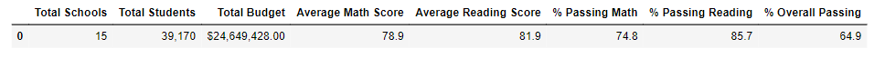
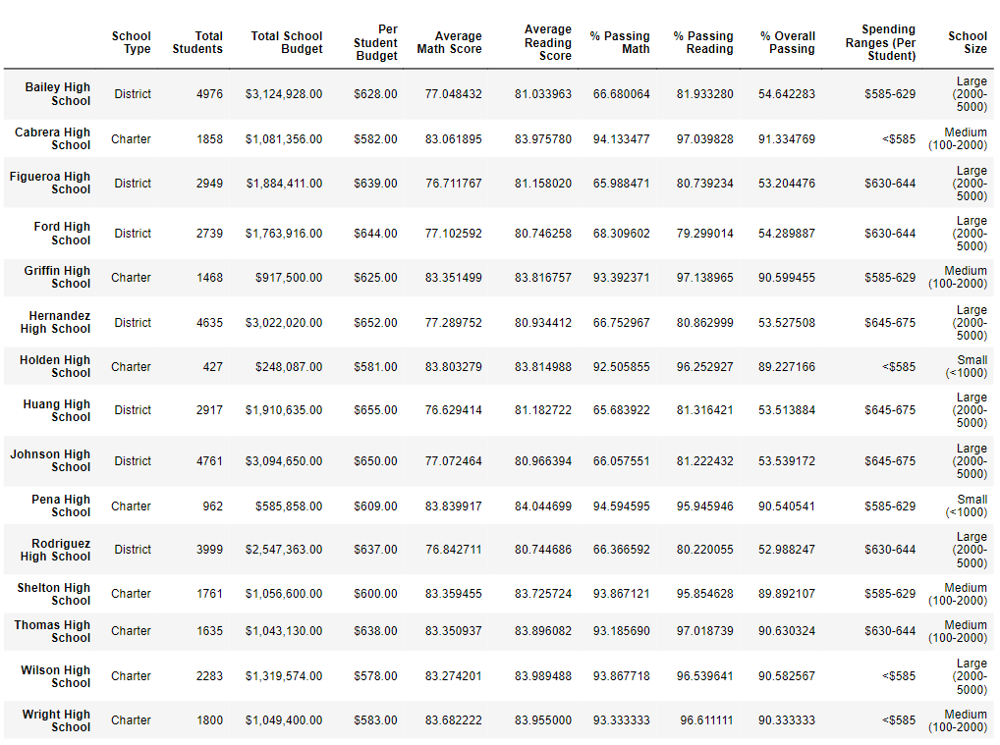
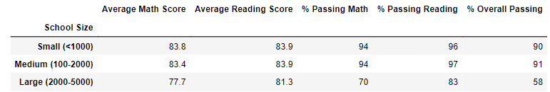
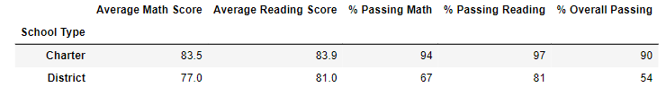

# School District Analysis

## Overview of the School District Analysis

The school board has found evidence of academic dishonesty in the student_complete.csv file; specifically, reading and math grades for Thomas High School ninth-graders appear to have been altered. Although the school board does not know the full extent of academic dishonesty, they want to uphold state-testing standards. The report replaced the math and reading scores for Thomas High School with NaNs while keeping the rest of the data intact. The analysis is repeated with NaNs in place and the rest of the data intact.

## Resources

**Data Source:** students_complete.csv, schools_complete.csv.

**Software:** Jupyter.

## Results

District Summary:
* 
* 
	-
	- 

School Summary:
* 
* 
	-
	- 
	-

Thomas High School perfomance Summary:
* 

![Thomas_df]Resources/Thomas_df.png)

*Ninth-grade Score substitution effect: 
	-
	- 

![student_data_df]Resources/student_data_df.png)

* Math and reading scores by grades:

	-Math Scores

![math_scores_by_grade]Resources/math_scores_by_grade.png)

	-Reading Scores

![reading_scores_by_grade]Resources/reading_scores_by_grade.png)

* Scores by spending, size, and type:

	-Scores by School spending

	- Scores by School size

	-Scores by School type

## Summary

