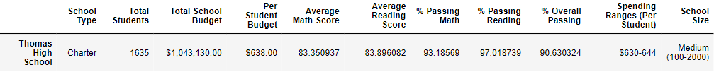

# School District Analysis

## Overview of the School District Analysis

The school board has found evidence of academic dishonesty in the student_complete.csv file; specifically, reading and math grades for Thomas High School ninth-graders appear to have been altered. Although the school board does not know the full extent of academic dishonesty, they want to uphold state-testing standards. The report replaced the math and reading scores for Thomas High School with NaNs while keeping the rest of the data intact. The analysis is repeated with NaNs in place and the rest of the data intact.

## Resources

**Data Source:** students_complete.csv, schools_complete.csv.

**Software:** Jupyter.

## Results

The school board requested deliverables:
- The districts metrics, presented in a table format
- The key metrics for each school, presented in a table format
- Tables metrics:
    - Top 5 and bottom 5 performing schools, based on the overall passing rate
    - The average math score received by students in each grade level at each school
    - The average reading score received by students in each grade level at each school
    - School performance based on the budget per student
    - School performance based on the school size 
    - School performance based on the type of school

District Summary:

School Summary:

Thomas High School perfomance Summary:
Math and reading scores for ninth graders at Thomas High School were replaced with 'NaN' (Not 0)so that their scores would not affect future calculations.  If all of the students' scores were replaced with a '0', then this would negatively impact averages for the school and school district.

## Summary
Removed 9th grade student scores from Thomas High School:
- Average math scores dropped slightly (<1%)
- Average reading scores were not affected
- Percentage of students passing math dropped slightly (-1%)
- Percentage of students passing reading dropped slightle (-1%)
- The overall passing rate dropped (-1%)

Affected scores for Thomas High School:
- Perentage of students passing math dropped from 93.2% to 66.9%
- Percentage of students passing reading dropped from 97.3% to 69.7%
- Overall passing percentage dropped from 90.9% to 65.1%

Thomas High School rankings:
- Thomas High school dropped out of the top 5 high schools in the district
- Wright High School moved into the top 5 high schools in the district
- Bottom 5 high schools was unaffected

Other affected reports from Thomas High School:
- Math and reading scores by grade remained the same for all other schools
- Thomas High School had no data to report for 9th grade math and reading scores
- Scores by school spending chaged at the $601-650 range:
    - Percentage passing math dropped from 73% to 67%
    - Percentage passing reading dropped from 84% to 77%
    - Overall passing percentage dropped from 63% to 56%
- Scores by school size changed for medium-sized schools (1000-2000):
    - Percentage passing math dropped from 94% to 85%
    - Percentage passing reading dropped from 97% to 91%
    - Overall passing percentage dropped from 91% to 85%
- Scores by schools type were affected in the following ways:
    - Percentage passing math dropped from 94% to 90%
    - Percentage passing reading dropped from 97% to 93%
    - Overall passing percentage dropped from 90% to 87%
